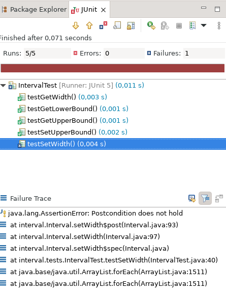

# First Steps in Modular Programming (Part II)

## Constructors

At this point, to use an `Interval` object to store a given interval, we must first create the object using a `new Interval()` expression, and then set its properties through the `setLowerBound`, `setUpperBound`, and/or `setWidth` setters. It is often convenient, and sometimes necessary, to allow client code to create an object and initialize its properties to desired values in one step. For this purpose, Java allows us to declare _constructors_. For example, we can allow clients to create an `Interval` object storing the interval with lower bound 3 and upper bound 7 using expression `new Interval(3, 7)` by inserting a _constructor declaration_ into class `Interval` as follows:

```java
package interval;

class Interval {
	private int lowerBound;
	private int upperBound;

	int getLowerBound() {
		return lowerBound;
	}
	
	int getUpperBound() {
		return upperBound;
	}
	
	int getWidth() {
		return upperBound - lowerBound;
	}
	
	Interval(int initialLowerBound, int initialUpperBound) {
		lowerBound = initialLowerBound;
		upperBound = initialUpperBound;
	}
	
	void setLowerBound(int value) {
		lowerBound = value;
	}
	
	void setUpperBound(int value) {
		upperBound = value;
	}
	
	void setWidth(int value) {
		upperBound = lowerBound + value;
	}

}
```

Notice the following:
- The name of a constructor is always simply the name of the class.
- A constructor declaration does not specify a return type.

Notice that Eclipse now marks expression `new Interval()` in `IntervalTest.java` as incorrect. Indeed, this expression refers to a constructor with zero parameters. If a class C does not explicitly declare a constructor, Java implicitly generates a _default constructor_ `C() {}`. Since we now explicitly declare a constructor, Java no longer generates this constructor and the expression `new Interval()` no longer works. To fix the error, we replace this expression with `new Interval(3, 7)`. We can now remove the setter calls:

```java
package interval;

import static org.junit.jupiter.api.Assertions.*;

import org.junit.jupiter.api.Test;

class IntervalTest {
	
	@Test
	void test() {
		Interval interval = new Interval(3, 7);

		int width = interval.getWidth();
		assert width == 4;
	}

}
```

## Overloading

But what if we want to initialize an `Interval` object with a given lower bound and a given width? That is, we would like to additionally declare the following constructor:

```java
	Interval(int lowerBound, int width) {
		this.lowerBound = lowerBound;
		this.upperBound = lowerBound + width;
	}
```

Java does not allow this, because there would be no way to decide which constructor to use to execute an instance creation expression `new Interval(3, 7)`. Java does allow a class to declare multiple constructors, but each constructor must have either a different number of parameters or different parameter types. So, one way to add our additional constructor is as follows:

```java
	Interval(int lowerBound, int width, Void dummy) {
		this.lowerBound = lowerBound;
		this.upperBound = lowerBound + width;
	}
```

(`Void` is a built-in class with no instances; the only value of type `Void` is `null`.) This works: now, we can replace expression `new Interval(3, 7)` by the equivalent expression `new Interval(3, 4, null)`.

(Note that distinguishing the two constructors by the presence of an unused dummy argument is not actually an ideal solution: the difference may be unintuitive and error-prone for clients of the API.
Some other programming languages support a more elegant approach.
Swift, for example, allows one to declare a constructor (called an _initializer_ in Swift) `init(lowerBound: Int, upperBound: Int)` and a separate constructor `init(lowerBound: Int, width: Int)`, with invocations like `Interval(lowerBound: 10, upperBound: 20)` and `Interval(lowerBound: 10, width: 20)` clearly distinguished by means of _argument labels_.
Unfortunately, Java does not support argument labels.)

Declaring multiple members with the same name is known as _overloading_. Java supports overloading of constructors, as well as methods. For example, we can extend our class with a method `setWidth` with two parameters that updates the lower bound or the upper bound, depending on the second argument:

```java
	void setWidth(int value, boolean updateLowerBound) {
		if (updateLowerBound)
			lowerBound = upperBound - value;
		else
			upperBound = lowerBound + value;
	}
```

## API Semantics: Documentation

Consider the following modified version of class `IntervalTest`:

```java
package interval;

import static org.junit.jupiter.api.Assertions.*;

import org.junit.jupiter.api.Test;

class IntervalTest {
	
	@Test
	void test() {
		Interval interval = new Interval(3, 4, null);

		interval.setUpperBound(8);
		assert interval.getLowerBound() == 3;
	}

}
```

It checks that updating an interval's upper bound leaves its lower bound unchanged. If we were to update method `setUpperBound` in class `Interval` so that it updates the lower bound and leaves the width unchanged, this change would break this client: the `assert` statement would fail. Who would be to blame? To eliminate this error, who would have to change their code? The author of `Interval` or the author of `IntervalTest`?

In this case, it is reasonable to say that the client is to blame: they assumed that method `setUpperBound` would leave the lower bound unchanged, but the author of class `Interval` has made no such promises. Unless module authors make specific guarantees about how a method will behave, it is always safest to assume the worst and not rely on anything that is not explicitly guaranteed.

So, if we, as a module author, want to allow clients to assume certain facts about our methods' behavior, we have to state those facts clearly in the module's documentation. Writing clear and precise documentation for modules will be a central focus of this course. For maximum clarity and precision, we will write statements in documentation both informally and formally. A fully documented version of class `Interval` looks like this:

```java
package interval;

/**
 * An object of this class stores an interval of integers.   
 * 
 * @invar This interval's lower bound is not greater than its upper bound.
 *     | getLowerBound() <= getUpperBound()
 * @invar This interval's width equals the difference between its upper bound
 *        and its lower bound.
 *     | getWidth() == getUpperBound() - getLowerBound()
 */
class Interval {
	
	/**
	 * @invar This interval's lower bound is not greater than its upper bound.
	 *      | lowerBound <= upperBound
	 */
	private int lowerBound;
	private int upperBound;

	int getLowerBound() {
		return lowerBound;
	}
	
	int getUpperBound() {
		return upperBound;
	}
	
	int getWidth() {
		return upperBound - lowerBound;
	}
	
	/**
	 * Initializes this interval with the given lower bound and upper bound.
	 * 
	 * @pre The given lower bound is not greater than the given upper bound.
	 *    | lowerBound <= upperBound
	 * @post This interval's lower bound equals the given lower bound.
	 *    | getLowerBound() == lowerBound
	 * @post This interval's upper bound equals the given upper bound.
	 *    | getUpperBound() == upperBound
	 */
	Interval(int lowerBound, int upperBound) {
		this.lowerBound = lowerBound;
		this.upperBound = upperBound;
	}

	/**
	 * Initializes this interval with the given lower bound and width.
	 *
	 * @pre The given width is nonnegative.
	 *    | 0 <= width
	 * @post This interval's lower bound equals the given lower bound.
	 *    | getLowerBound() == lowerBound
	 * @post This interval's width equals the given width.
	 *    | getWidth() == width
	 */
	Interval(int lowerBound, int width, Void dummy) {
		this.lowerBound = lowerBound;
		this.upperBound = lowerBound + width;
	}
	
	/**
	 * Sets this interval's lower bound to the given value.
	 *
	 * @pre The given value is not greater than this interval's upper bound.
	 *    | value <= getUpperBound()
	 * @post This interval's lower bound equals the given value.
	 *    | getLowerBound() == value
	 * @post This interval's upper bound has remained unchanged.
	 *    | getUpperBound() == old(getUpperBound())
	 */
	void setLowerBound(int value) {
		lowerBound = value;
	}
	
	/**
	 * Sets this interval's upper bound to the given value.
	 * 
	 * @pre The given value is not less than this interval's lower bound.
	 *    | getLowerBound() <= value
	 * @post This interval's upper bound equals the given value.
	 *     | getUpperBound() == value
	 * @post This interval's lower bound has remained unchanged.
	 *     | getLowerBound() == old(getLowerBound())  
	 */
	void setUpperBound(int value) {
		upperBound = value;
	}
	
	/**
	 * Sets this interval's width to the given value.
	 * 
	 * @pre The given value is nonnegative.
	 *    | 0 <= value
	 * @post This interval's width equals the given value.
	 *     | getWidth() == value
	 * @post This interval's lower bound has remained unchanged.
	 *     | getLowerBound() == old(getLowerBound())
	 */
	void setWidth(int value) {
		upperBound = lowerBound + value;
	}
	
	/**
	 * Sets this interval's width to the given value.
	 *
	 * @pre The given value is nonnegative.
	 *    | 0 <= value
	 * @post This interval's width equals the given value.
	 *     | getWidth() == value
	 * @post If the caller specified that the lower bound should be updated, the
         *       upper bound has remained unchanged.
	 *     | !updateLowerBound || getUpperBound() == old(getUpperBound())
	 * @post If the caller specified that the lower bound should not be updated,
         *       the lower bound has remained unchanged.
	 *     | updateLowerBound || getLowerBound() == old(getLowerBound())
	 */
	void setWidth(int value, boolean updateLowerBound) {
		if (updateLowerBound)
			lowerBound = upperBound - value;
		else
			upperBound = lowerBound + value;
	}

}
```

Notice that we write documentation structured into four kinds of _clauses_:
- _Postconditions_, indicated by tag `@post`, state conditions that are promised by the module author to be true after execution of the method, provided that the method's preconditions are true before execution of the method.
- _Preconditions_, indicated by tag `@pre`, state conditions that must be true at the start of an execution of the method. If at the start of a particular execution of a method, the method's preconditions are not true, then the module author is not required to ensure that the method's postconditions are true at the end of this execution.
- _Private invariants_, also known as _representation invariants_, indicated by tag `@invar` in a documentation comment preceding the private fields of a class, state conditions on the values of the fields of an object that must be true for the object to be considered to be in a valid state. It is a module author's responsibility to ensure that an object is in a valid state whenever no constructor or method of the object is being executed. Note: the private invariants are not part of the API specification; they serve only as internal documentation for the module author's own use to facilitate their reasoning about the correctness of their module.
- _Public invariants_, indicated by tag `@invar` in the documentation comment for the class declaration itself, state conditions on the values returned by the getters of an object that must be true whenever no constructor or method of the object is being executed. It is a module author's responsibility to ensure this.

## Testing an abstraction: API unit tests

Ideally, when we carefully define and document an API, the implementation of the API can be developed independently from clients of the API.
For example, in the previous section, we modified the implementatoni of `Interval` to use a different internal representation.
Thanks to the precisely documented abstract API, we can be sure that clients will continue to behave as intended, essentially because we know two things:
- Clients of the API only depend on public parts of the API and the contracts specified in its documentation.
- The new API implementation does not modify public parts of the API and still satisfies the contracts specified in its documentation.
Of course, both of these facts are only true for properly developed clients and implementations. 

The former fact (clients only depend on public parts of the API and the documented contracts) is partly enforced by the Java programming language, which ensures that clients cannot access instance variables marked private.
However, a poorly developed client might rely on an _implementation detail_: an aspect of the behavior of `Interval`'s implementation that is not documented in the API contract.
Such clients' expectations may be broken when the implementation of `Interval` is modified, in which case the client developer is to blame because they relied on behavior not guaranteed by the API.
We've seen an example of this in the previous section, where a client assumed that `setUpperBound` would leave the lower bound of the `Interval` unchanged even though the documentation didn't guarantee this.

The latter fact (the new implementation of the API does not modify public aspects of the API and still satisfies the contracts specified in its documentation) can also be violated.
Programming errors by the developer of the API implementation can cause some of the contracts to be broken.
For example, remember that we have the following instance methods in our implementation of `Interval`.
```java
	/**
	 * Sets this interval's width to the given value.
	 * 
	 * @pre The given value is nonnegative.
	 *    | 0 <= value
	 * @post This interval's width equals the given value.
	 *     | getWidth() == value
	 * @post This interval's lower bound has remained unchanged.
	 *     | getLowerBound() == old(getLowerBound())
	 */
	void setWidth(int value) {
		upperBound = lowerBound + value;
	}
	
	/**
	 * Sets this interval's width to the given value.
	 *
	 * @pre The given value is nonnegative.
	 *    | 0 <= value
	 * @post This interval's width equals the given value.
	 *     | getWidth() == value
	 * @post If the caller specified that the lower bound should be updated, the
     *       upper bound has remained unchanged.
	 *     | !updateLowerBound || getUpperBound() == old(getUpperBound())
	 * @post If the caller specified that the lower bound should not be updated,
     *       the lower bound has remained unchanged.
	 *     | updateLowerBound || getLowerBound() == old(getLowerBound())
	 */
	void setWidth(int value, boolean updateLowerBound) {
		if (updateLowerBound)
			lowerBound = upperBound - value;
		else
			upperBound = lowerBound + value;
	}

```
Imagine that the developer decides to modify the implementation of `setWidth(int value)` to reuse the implementation of `setWidth(int value, boolean updateLowerBound)`, but accidentally provides the wrong second argument:
```java
	void setWidth(int value) {
		setWidth(value, true);
	}
```
This change will make `setWidth(int value)` modify the lower bound of the `Interval` contrary to what its contract specifies.
Clearly, such an error may break clients of the API whose correctness relies on the contract of the method and, consequentially, the programs they are part of.

In order to reduce the likelihood of such implementation errors going undetected, and, conversely, to reduce the risk of modifying API implementations, developers construct _unit tests_, to automatically test whether API implementations (still) satisfy the documented contracts.
Unit tests are automated because they are intended to be re-run many times, for example after every change in the codebase or before every release of a library.
This is important because they are not just intended for detecting errors in the current implementations of APIs, but also in future versions of the implementations.
A collection of unit tests for an API is called a _test suite_ and unit test frameworks like JUnit are widely used to facilitate their definition and use.

We have already encountered some unit tests in the previous sections like the following `IntervalTest`:
```java
package interval;

import static org.junit.jupiter.api.Assertions.*;

import org.junit.jupiter.api.Test;

class IntervalTest {
	
	@Test
	void testSetUpperBound() {
		Interval interval = new Interval(3, 4, null);

		interval.setUpperBound(8);
		assertEquals(interval.getLowerBound(), 3);
	}

}
```
When using JUnit, unit tests are defined in separate classes like `IntervalTest`.
Individual tests are identified by the `@Test` annotation on methods of the test class.
They return type `void` and take no arguments.
Inside the method, arbitrary properties may be tested, preferably using static methods like `assertTrue`, `assertEquals`, `assertNotEquals`, `assertNull`, `assertNotNull`, `assertThrows` defined in the [org.junit.jupiter.api.Assertions class](https://junit.org/junit5/docs/current/api/org.junit.jupiter.api/org/junit/jupiter/api/Assertions.html).
Note that our example code imports all static methods from this class using an `import static` statement.

In order to facilitate writing many similar tests, JUnit allows programmers to define a _test fixture_ in a JUnit test class, i.e. common test data and test initialization code that is shared between many tests:
```java
class IntervalTest {
	Interval myInterval;
	
	@BeforeEach
	void initEach() {
		myInterval = new Interval(4, 7);
	}
	
	@Test
	void testGetLowerBound() {
		assertEquals(4, myInterval.getLowerBound());
	}
	
	@Test
	void testGetUpperBound() {
		assertEquals(7, myInterval.getUpperBound());
	}
	
	@Test
	void testGetWidth() {
		assertEquals(3, myInterval.getWidth());
	}
	
	@Test
	void testGetElements() {
		assertArrayEquals(new int[] {4, 5, 6, 7}, myInterval.getElements());
	}
    
    @Test
    void testSetUpperBound() {
		myInterval.setUpperBound(8);
		assertEquals(myInterval.getLowerBound(), 4);
		assertEquals(myInterval.getUpperBound(), 8);
    }

  	@Test
	void testSetWidth() {
		myInterval.setWidth(5);
		assertEquals(myInterval.getWidth(), 5);
		assertEquals(myInterval.getLowerBound(), 4);
	}

    //...
}
```
The above code uses an instance variable myInterval as test data in several tests and initializes it in a method `initEach`.
The @BeforeEach annotation signals to JUnit that `initEach` should be run before every individual test.
It is generally a good idea to reinitialize test data before every test to prevent modifications made during one test to affect the outcome of other tests.

The error mentioned above (implementing `setWidth(int value)` in terms of `setWith(int value, boolean updateLowerBound)`) would be detected by the above test suite.
When we right-click the IntervalTest class and select "Run As" > "JUnit Test", we would normally see the following test failure:


In fact, because we are using FSC4J, we actually get a different result:



This is because FSC4J will implicitly add assertions to every functions to verify that its postcondition holds and it is this postcondition failure that is detected by the JUnit test case.
As a result, when using FSC4J, we can in fact simplify our test suite, as it is unnecessary to explicitly test postconditions:

```java
    //...
    
    @Test
    void testSetUpperBound() {
		myInterval.setUpperBound(8);
    }

  	@Test
	void testSetWidth() {
		myInterval.setWidth(5);
	}

    //...
```
