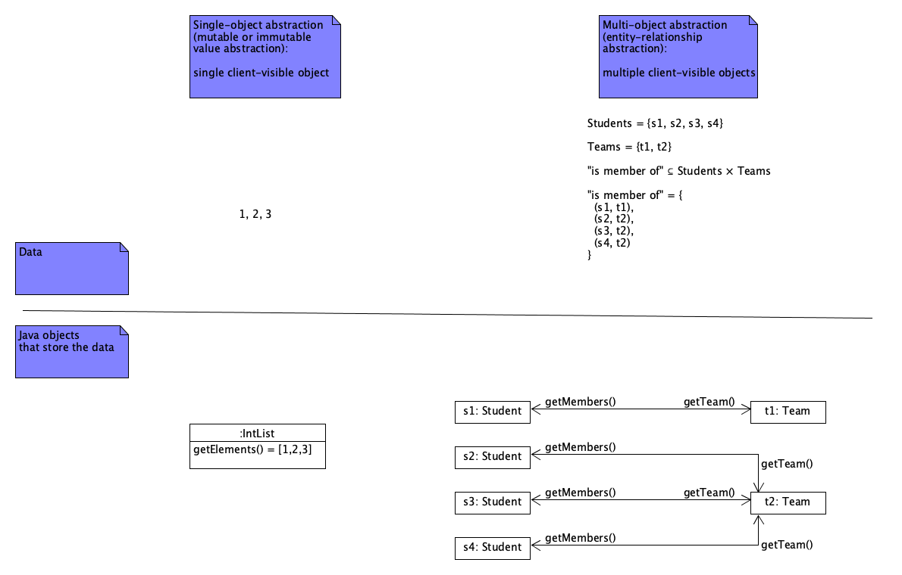

# Multi-class entity-relationship abstractions

In [Entity-relationship abstractions](entity_relationship_abstractions.md), we
introduced the concept of entity-relationship abstractions. The examples we
discussed there involved entity graphs consisting of only a single type of
entity: `OOPStudent`. Such abstractions are built from groups of instances of
class `OOPStudent`. We refer to such abstractions as _single-class
entity-relationship abstractions_.

In this note, we consider the task of designing and implementing abstractions
that store entity graphs involving multiple entity types. We will declare a
separate class for each entity type. Such abstractions are therefore
_multi-class entity-relationship abstractions_.

To illustrate the concepts, we will consider a generalization of the OOP team
composition graphs example: we will consider graphs of project course students
and the teams they belong to. For simplicity, a team may have arbitrarily many
members, but each student may be a member of only one team.

To implement an abstraction for storing such graphs, we will introduce a class `ProjectCourseStudent` to represent students and
a class `Team` to represent teams:

</img>

Here is an initial attempt at implementing these classes:

```java
package bigteams;

public class ProjectCourseStudent {
    
    private Team team;
    
    public Team getTeam() { return team; }
    
    public ProjectCourseStudent() {}

    public void join(Team team) {
        if (this.team != null)
            throw new IllegalStateException("this student is already in a team");
        
        this.team = team;
        team.members.add(this);
    }

    public void leaveTeam() {
        if (this.team == null)
            throw new IllegalStateException("this student is not in a team");
        
        team.members.remove(this);
        team = null;
    }
}
```

```java
package bigteams;

public class Team {
    
    private HashSet<ProjectCourseStudent> members = new HashSet<>();
    
    public Set<ProjectCourseStudent> getMembers() { return Set.copyOf(members); }

    public Team() {}
    
}
```

```java
package bigteams;

import static org.junit.jupiter.api.Assertions.*;

import org.junit.jupiter.api.Test;

class BigTeamsTest {

    @Test
    void test() {
        ProjectCourseStudent student1 = new ProjectCourseStudent();
        ProjectCourseStudent student2 = new ProjectCourseStudent();
        Team team = new Team();
        
        student1.join(team);
        assertEquals(team, student1.getTeam());
        assertEquals(Set.of(student1), team.getMembers());
        
        student2.join(team);
        assertEquals(team, student2.getTeam());
        assertEquals(Set.of(student1, student2), team.getMembers());
        
        student1.leaveTeam();
        assertEquals(Set.of(student2), team.getMembers());
        
        student2.leaveTeam();
        assertEquals(Set.of(), team.getMembers());
    }

}
```

Notice that we use a [`HashSet`](https://docs.oracle.com/en/java/javase/13/docs/api/java.base/java/util/HashSet.html) to store the members of a team.
Class `HashSet` is a _generic class_; it takes the type of its elements as a _type parameter_. In the _parameterized type_ `HashSet<ProjectCourseStudent>`,
`ProjectCourseStudent` is the _type argument_ for generic class `HashSet`.

Type `HashSet<T>` is a _subtype_ of type `Set<T>`. This means that every instance of `HashSet<T>` is also an instance of `Set<T>`.

Notice also that we implement a bidirectional association between classes `ProjectCourseStudent` and class `Team`, and we make sure that its
_consistency_ is preserved at all times: if a `ProjectCourseStudent` instance S refers to a `Team` instance T, then T also refers to S, and vice versa.

Unfortunately, the code above is rejected by Java's static type checker. Indeed, class `ProjectCourseStudent` accesses class `Team`'s private field
`members`. The private fields of a class may be accessed by the class itself only. We could make field `members` `public` but this would break
the abstraction's _encapsulation_: clients would see the abstraction's internal implementation details and could modify the field without respecting the abstraction's
representation invariants. For example, a client could set the `members` field of some `Team` instance T to `null` or could add a `ProjectCourseStudent` instance S to its `HashSet` without
updating S's `team` field to point to T, thus breaking the consistency of the bidirectional association and the validity of the abstraction's representation.

What we need is some way to make field `members` accessible to class `ProjectCourseStudent` without making it accessible to clients. In Java, this can be done
by putting classes `ProjectCourseStudent` and `Team` into a _package_ by themselves, and making field `members` _package-accessible_. A Java program element is package-accessible by
default; that is, if you do not specify any accessibility modifier (such as `private` or `public`) for a program element, the program element is package-accessible. This means
it may be accessed by any code in the same package.

We conclude that to implement multi-class abstractions, we generally need to implement them using a _package_ as the unit of encapsulation rather than a _class_. We apply this
principle to the example by moving the example client (class `BigTeamsTest`) out of package `bigteams` and by making the fields of class `ProjectCourseStudent` and `Team` package-accessible.
Analogously to class-encapsulated abstractions, we specify package representation invariants (using `@invar` clauses in the fields' Javadoc comments) and package abstract state invariants (using `@invar` clauses in the classes' Javadoc comments):

```java
package bigteams;

import logicalcollections.LogicalSet;

/**
 * Each instance of this class represents a student in a project course,
 * as part of a student-team graph.
 * 
 * @invar If a student is in a team, it is among its members.
 *    | getTeam() == null || getTeam().getMembers().contains(this)
 */
public class ProjectCourseStudent {
    
    /**
     * @invar | true  // Phase 1 representation invariant
     * @invar | team == null || team.members.contains(this)  // Phase 2 rep. inv.
     * 
     * @peerObject
     */
    Team team;
    
    /**
     * Returns this student's team, or {@code null} if they are not in a team.
     * 
     * @peerObject
     * @basic
     */
    public Team getTeam() { return team; }
    
    /**
     * Initializes this object as representing a student who is not in a team.
     */
    public ProjectCourseStudent() {}

    /**
     * Make this student a member of the given team.
     *
     * @throws IllegalArgumentException if {@code team} is null.
     *    | team == null
     * @throws IllegalStateException if this student is already in a team.
     *    | getTeam() != null
     * 
     * @mutates_properties | this.getTeam(), team.getMembers()
     * 
     * @post The given team's members equal its old members plus this student.
     *    | team.getMembers().equals(LogicalSet.plus(old(team.getMembers()), this))
     */
    public void join(Team team) {
        if (team == null)
            throw new IllegalArgumentException("team is null");
        if (this.team != null)
            throw new IllegalStateException("this student is already in a team");
        
        this.team = team;
        team.members.add(this);
    }

    /**
     * Make this student no longer be a member of their team.
     * 
     * @throws IllegalStateException if this student is not in a team.
     *    | getTeam() == null
     * 
     * @mutates_properties | this.getTeam(), this.getTeam().getMembers()
     * 
     * @post This student is not in a team.
     *    | getTeam() == null
     * @post This student's old team's members are its old members minus this
     *       student.
     *    | old(getTeam()).getMembers().equals(
     *    |     LogicalSet.minus(old(getTeam().getMembers()), this))
     */
    public void leaveTeam() {
        if (this.team == null)
            throw new IllegalStateException("this student is not in a team");
        
        team.members.remove(this);
        team = null;
    }
}
```

```java
package bigteams;

import java.util.HashSet;
import java.util.Set;

/**
 * Each instance of this class represents a team in a student-team graph.
 * 
 * @invar Each of this team's members has this team as its team.
 *    | getMembers().stream().allMatch(s -> s != null && s.getTeam() == this)
 */
public class Team {
    
    /**
     * @invar | members != null  // Phase 1 representation invariant
     * @invar | members.stream().allMatch(s ->
     *        |     s != null && s.team == this)  // Phase 2 rep. inv.
     * 
     * @representationObject
     * @peerObjects
     */
    HashSet<ProjectCourseStudent> members = new HashSet<>();
    
    /**
     * Returns this team's set of members.
     * 
     * @post | result != null
     * @creates | result
     * @peerObjects
     * @basic
     */
    public Set<ProjectCourseStudent> getMembers() { return Set.copyOf(members); }

    /**
     * Initializes this object as representing an empty team.
     * 
     * @mutates | this
     * @post This team has no members.
     *    | getMembers().isEmpty()
     */
    public Team() {}
    
}
```

```java
package bigteams.tests;

import static org.junit.jupiter.api.Assertions.*;

import java.util.Set;

import org.junit.jupiter.api.Test;

import bigteams.ProjectCourseStudent;
import bigteams.Team;

class BigTeamsTest {

    @Test
    void test() {
        ProjectCourseStudent student1 = new ProjectCourseStudent();
        ProjectCourseStudent student2 = new ProjectCourseStudent();
        Team team = new Team();
        
        student1.join(team);
        assertEquals(team, student1.getTeam());
        assertEquals(Set.of(student1), team.getMembers());
        
        student2.join(team);
        assertEquals(team, student2.getTeam());
        assertEquals(Set.of(student1, student2), team.getMembers());
        
        student1.leaveTeam();
        assertEquals(Set.of(student2), team.getMembers());
        
        student2.leaveTeam();
        assertEquals(Set.of(), team.getMembers());
    }

}
```

Notice the following:
- We define each object's peer group by putting a `@peerObject` tag in the Javadoc comment for field `team` and a `@peerObjects` tag in the Javadoc comment for field `members`. The latter means that for any `Team` object T, each element of `T.members` is a peer object of T.
- We also let our clients know each object's peer group by also putting a `@peerObject` tag in the Javadoc comment for getter `getTeam()` and a `@peerObjects` tag in the Javadoc comment for getter `getMembers()`.
- The representation invariant `team == null || team.members.contains(this)` declared in class `ProjectCourseStudent` is not well-defined if `team.members` is null. This invariant should be guarded by another invariant that says that `team.members` is not null, and that is checked first. There is a representation invariant `members != null` in class `Team`. We can use it to guard the invariant in class `ProjectCourseStudent` by defining the order of checking the representation invariants of a peer group as follows: first, the Phase 1 representation invariant of each peer object is checked; then, the Phase 2 representation invariant of each peer object is checked; and so on, until all representation invariants have been checked. We simply define the Phase 1 representation invariant of an object to be the first representation invariant defined in the object's class, and so on. This is why we insert a dummy representation invariant `true` into class `ProjectCourseStudent`; this ensures that the invariant that relies on `team.members` being non-null is a Phase 2 invariant.
- We use methods `LogicalSet.plus` and `LogicalSet.minus` from [`logicalcollections`](https://github.com/btj/logicalcollections) to concisely specify the effect of `join` and `leaveTeam` on the team's set of members.
- We use a `@mutates_properties | this.getTeam(), team.getMembers()` clause to conveniently specify that `joinTeam(team)` mutates the peer group of `this` and the peer group of `team`, and that for any object O in either of these peer groups, and for any basic getter M of O, we have either that (O, M) is in the set {(`this`, `getTeam`), (`team`, `getMembers`)} or `Objects.equals(O.M(), old(O.M()))`. That is, from the client's point of view, `joinTeam(team)` mutates only `this.getTeam()` and `team.getMembers()` and leaves all other properties of both peer groups involved (as given by the peer group objects' basic getters) unchanged. (A getter is basic if it is marked using the `@basic` tag.)

## Nesting class-encapsulated and package-encapsulated abstractions

Making the fields of a module package-accessible is probably fine for small modules such as the example module, but for larger modules this quickly becomes error-prone. Therefore, it is preferrable to _always_ declare fields as `private`, and to encapsulate them into a class-level abstraction, even if the class is part of a multi-class abstraction as well. We call this a case of _nested abstractions_. In such cases of class-level abstractions nested within a package-level abstraction, each class of the package is a _client_ of the class-level abstractions implemented by the other classes of the package.

When doing so, we can take the opportunity to move as many of the package's representation invariants as possible into the individual class-level abstractions. In the example, we can move the invariants stating that `members` is not null and that the elements of `members` are not null into the `Team` class-level abstraction:

```java
package bigteams;

import logicalcollections.LogicalSet;

/**
 * Each instance of this class represents a student in a project course,
 * as part of a student-team graph.
 * 
 * @invar If a student is in a team, it is among its members.
 *    | getTeam() == null || getTeam().getMembers().contains(this)
 */
public class ProjectCourseStudent {
    
    private Team team;

    /**
     * @invar | getTeamInternal() == null
     *        | || getTeamInternal().getMembersInternal().contains(this)
     * 
     * @peerObject
     */
    Team getTeamInternal() { return team; }
    
    /**
     * Returns this student's team, or {@code null} if they are not in a team.
     * 
     * @peerObject
     * @basic
     */
    public Team getTeam() { return team; }
    
    /**
     * Initializes this object as representing a student who is not in a team.
     */
    public ProjectCourseStudent() {}

    /**
     * Make this student a member of the given team.
     *
     * @throws IllegalArgumentException if {@code team} is null.
     *    | team == null
     * @throws IllegalStateException if this student is already in a team.
     *    | getTeam() != null
     * 
     * @mutates_properties | this.getTeam(), team.getMembers()
     * 
     * @post The given team's members equal its old members plus this student.
     *    | team.getMembers().equals(LogicalSet.plus(old(team.getMembers()), this))
     */
    public void join(Team team) {
        if (team == null)
            throw new IllegalArgumentException("team is null");
        if (this.team != null)
            throw new IllegalStateException("this student is already in a team");
        
        this.team = team;
        team.addMember(this);
    }

    /**
     * Make this student no longer be a member of their team.
     * 
     * @throws IllegalStateException if this student is not in a team.
     *    | getTeam() == null
     * 
     * @mutates_properties | this.getTeam(), this.getTeam().getMembers()
     * 
     * @post This student is not in a team.
     *    | getTeam() == null
     * @post This student's old team's members are its old members minus this
     *       student.
     *    | old(getTeam()).getMembers().equals(
     *    |     LogicalSet.minus(old(getTeam().getMembers()), this))
     */
    public void leaveTeam() {
        if (this.team == null)
            throw new IllegalStateException("this student is not in a team");
        
        team.removeMember(this);
        team = null;
    }
}
```

```java
package bigteams;

import java.util.HashSet;
import java.util.Set;

import logicalcollections.LogicalSet;

/**
 * Each instance of this class represents a team in a student-team graph.
 * 
 * @invar Each of this team's members has this team as its team.
 *    | getMembers().stream().allMatch(s -> s != null && s.getTeam() == this)
 */
public class Team {

    /**
     * @invar | members != null
     * @invar | members.stream().allMatch(s -> s != null)
     * 
     * @representationObject
     */
    private HashSet<ProjectCourseStudent> members = new HashSet<>();
    
    /**
     * Returns this team's set of members.
     * 
     * @invar | getMembersInternal().stream().allMatch(s ->
     *        |     s.getTeamInternal() == this)
     * 
     * @post | result != null && result.stream().allMatch(s -> s != null)
     * @peerObjects
     */
    Set<ProjectCourseStudent> getMembersInternal() { return Set.copyOf(members); }
    
    /**
     * Returns this team's set of members.
     * 
     * @post | result != null
     * @creates | result
     * @peerObjects
     * @basic
     */
    public Set<ProjectCourseStudent> getMembers() { return Set.copyOf(members); }

    /**
     * Initializes this object as representing an empty team.
     * 
     * @mutates | this
     * @post This team has no members.
     *    | getMembers().isEmpty()
     */
    public Team() {}
    
    /**
     * Adds the given student to this team's set of students.
     * 
     * @throws IllegalArgumentException if {@code student} is null
     *    | student == null
     * @mutates | this
     * @post This team's set of members equals its old set of members plus the
     *       given student.
     *    | getMembersInternal().equals(
     *    |     LogicalSet.plus(old(getMembersInternal()), student))
     */
    void addMember(ProjectCourseStudent student) {
        if (student == null)
            throw new IllegalArgumentException("student is null");
        
        members.add(student);
    }
    
    /**
     * Removes the given student from this team's set of students.
     * 
     * @throws IllegalArgumentException if {@code student} is null
     *    | student == null
     * @mutates | this
     * @post This team's set of members equals its old set of members minus the
     *       given student.
     *    | getMembersInternal().equals(
     *    |     LogicalSet.minus(old(getMembersInternal()), student))
     */
    void removeMember(ProjectCourseStudent student) {
        if (student == null)
            throw new IllegalArgumentException("student is null");
        
        members.remove(student);
    }
    
}
```
(We do not show class `BigTeamsTest` again because it is unchanged.)

Notice the following:
- An instance of a class that is part of a class-encapsulated abstraction nested within a package-encapsulated abstraction may have both a class-level peer group and a package-level peer group. The class-level peer group is always a subset of the package-level peer group. The class-level peer group is defined by the `@peerObject` and `@peerObjects` tags in the Javadoc comments for the class's private fields; the package-level peer group is defined by the `@peerObject` and `@peerObjects` tags in the Javadoc comments for the package's package-accessible getters. In the example, the objects have no class-level peer groups (or, equivalently, the class-level peer group of O is just the singleton {O}).
- We specify a class-level abstraction's representation invariants using `@invar` tags in the Javadoc comments for the class' private fields.
- In the case of a class-encapsulated abstraction nested within a package-encapsulated abstraction, we specify the class-level abstraction's abstract state invariants using `@post` tags in the Javadoc comments for the class' nonprivate getters.
- We specify a package-level abstraction's representation invariants using `@invar` tags in the Javadoc comments for the package's package-accessible fields or getters.
- We specify a package-level abstraction's abstract state invariants using `@invar` tags in the Javadoc comments for the package's classes and/or using `@post` tags in the Javadoc comments for the package's public getters.
- A public constructor's author must ensure that when the constructor returns, all of the constructed object's class-level and package-level representation invariants hold. (Those of its peer objects must hold as well, but usually a newly constructed object does not yet have any peer objects.)
- At every call of a package-accessible method, it is the caller's responsibility to ensure that for each member O of the class-level peer group of each object inspected or mutated by the method, all of O's class-level representation invariants hold. It is the method author's responsibility to ensure that all of these invariants hold again when the method returns.
- At every call of a public method, it is the caller's responsibility to ensure that for each member O of the package-level peer group of each object inspected or mutated by the method, all of O's class-level and package-level representation invariants hold. It is the method author's responsibility to ensure that all of these invariants hold again when the method returns.
- This means that it is not correct to call package-accessible getters inside a class-level representation invariant or public getters inside any representation invariant, because this would introduce a circularity: the getter would be allowed to assume the invariants in whose definition it is involved. It is, however, allowed (and generally necessary) to call package-accessible getters in package-level representation invariants, because these getters can assume only the class-level representation invariants.
- We introduce package-accessible mutators `addMember` and `removeMember` into class `Team` to allow methods `join` and `leaveTeam` in class `ProjectCourseStudent` to restore the consistency of the package-level bidirectional association.
